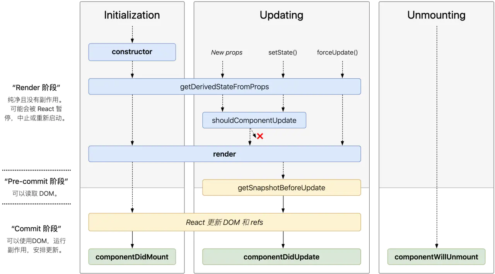

# 生命周期

## React V16.0 之前

- Initializing
  - `constructor()`
- Mounting
  - `componentWillMount()`
  - `render()`
  - `componentDidMount()`
- Updating
  - 父组件的重新渲染引起当前组件变化
    - `componentWillReceiveProps(nextProps)`
    - `shouldComponentUpdate(nextProps, nextState)`
    - `componentWillUpdate(nextProps, nextState)`
    - `render()`
    - `componentDisUpdate(prevProps, prevState)`
  - 组件自身 state 的变化
    - `shouldComponentUpdate(nextProps, nextState)`
    - `componentWillUpdate(nextProps, nextState)`
    - `render()`
    - `componentDisUpdate(prevProps, prevState)`
- Unmounting
  - `componentWillUnmount()`

## 现在(Fiber 架构)

- `getDerivedStateFromProps(nextProps, prevState)`
- `getSnapshotBeforeUpdate(prevProps, prevState)`
